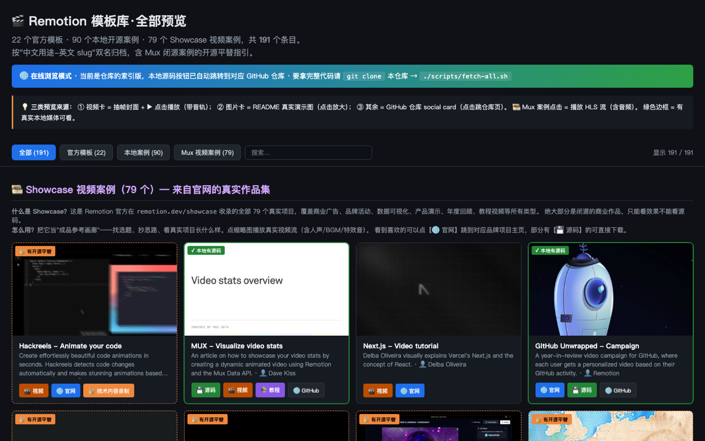

# Remotion 中文导航 · remotion-zh

> **191 张卡片预览 · 22 官方模板 + 90 个开源案例 + 79 个 Mux Showcase**
> 全中文导航 · 双名归档（中文用途 + 原英文 slug）· 含 Mux 闭源案例的开源平替指引

[](https://aguaishuo.github.io/remotion-zh/)
[](LICENSE)
[](https://github.com/aguaishuo/remotion-zh)

[](https://aguaishuo.github.io/remotion-zh/)

<sub>↑ 首页截图（点图跳在线预览）· 完整长图见 [`_screenshots/preview-full.png`](_screenshots/preview-full.png)</sub>

---

## 这是什么

中文社区第一个 [Remotion](https://www.remotion.dev/) 全景导航库。把 Remotion 官方仓库的 22 个模板、resources.mdx 里 70+ 个第三方项目、Showcase 上 79 个真实商业案例，以及 2025–2026 年 GitHub 高星社区项目，统一收进一张**单页 HTML**，可视化预览、按用途分类、点击直跳源码。

**和 awesome-remotion 不同**：

- 一页看完 191 个项目（不是一长串 Markdown 链接）
- 中文用途名 + 英文 slug 双名归档（找模板不用对着英文猜功能）
- ⭐ 独家：Mux Showcase 闭源案例 → 开源平替映射表（21 条）
- GitHub opengraph 社交卡 + ffmpeg 抽帧封面 + Mux HLS 音频流，索引版纯静态可访问

## 快速开始

### A. 在线浏览（最快）

直接打开 → **https://aguaishuo.github.io/remotion-zh/**

视频卡可播 Mux 流（含音频），第三方案例按钮一键跳 GitHub 仓库。

### B. 本地克隆（拿源码）

```bash
git clone https://github.com/aguaishuo/remotion-zh
cd remotion-zh

# 全量克隆 90 个第三方 + 22 官方模板（约 5-10GB）
./scripts/fetch-all.sh

# 或只取你需要的梯队
./scripts/fetch-tier1.sh   # 5 个：Claude Code 视频工具包 + 可复用组件库
./scripts/fetch-tier2.sh   # 5 个：AI 短视频管线（TikTok/Reels 批量生成）

# 然后浏览器打开
open 预览首页.html
```

> 💡 索引版（仓库）只有 ~10MB，纯静态可用；想离线拿全部源码再跑 fetch 脚本。

## 仓库结构

```
remotion-zh/
├── index.html / 预览首页.html  # 191 张卡片单页预览（在线/本地双模式自动切换）
├── data/
│   ├── 模板列表.json            # 22 个 Remotion 官方模板元数据
│   ├── 案例列表.json            # 90 个第三方案例（owner/repo/分类/GitHub URL）
│   ├── showcase数据源.json      # 79 个 Mux Showcase 案例
│   ├── Mux匹配本地源码.json     # 12 个 Mux 案例 ↔ 本地源码映射（绿框）
│   ├── Mux开源平替.json         # 21 个 Mux 闭源案例 → 开源平替映射（橙框）⭐
│   └── Remotion官方资源页_resources.mdx
├── _社交卡缓存/                # 112 张 GitHub opengraph 缩略图（避免 rate limit）
└── scripts/
    ├── fetch-all.sh             # 全量克隆 90+22
    ├── fetch-tier1.sh           # 仅第一梯队 5 个
    ├── fetch-tier2.sh           # 仅第二梯队 5 个
    └── refresh-social-cards.sh  # 重拉社交卡
```

## 三色标记体系（Mux Showcase）

`预览首页.html` 给 79 个 Mux 案例按"源码可得性"打颜色：

| 颜色 | 含义 | 数量 |
|---|---|---|
| 🟢 绿色实线 | 本地有该案例的源码（直接对应仓库已克隆） | 12 |
| 🟠 橙色虚线 | 案例闭源但本地有功能等价的开源平替 | 21 |
| ⚪ 无标记 | 商业闭源，全网无开源替代 | 46 |

## 13 类用途分类（90 个第三方案例）

按 `data/案例列表.json` 自动统计：

| 分类 | 数量 | 代表项目 |
|---|---|---|
| 转场/动效 | 17 | spring-loaded, light-leak-example, dvd-logo, morph-text |
| 数据可视化 | 9 | mux-remotion-demo, datavids_public, weather, bar-race-chart |
| AI 短视频管线 | 8 | brainrot.js, short-video-maker, OpenReels, jiang-clips |
| 音频/字幕 | 7 | audiogram, Remotion-TTS, tone-js, podcast-maker |
| GitHub 主题 | 7 | github-unwrapped (2021/2022), stargazer, contribution-graph |
| 3D/Three.js | 6 | three-particles, glb-example, remotion-globegl |
| 集成/部署 | 4 | react-native-demo, docker-template, devcontainer |
| Remotion 官方 | 4 | trailer (1.0/2.0/4.0), example-remotion |
| 视频编辑器 | 3 | a-react-video-editor, motionly, reactvideoeditor-templates |
| 组件库 | 3 | remotion-bits, remotion-animated, clippkit |
| 视频排版 | 2 | a-roll, jumpcuts |
| Claude/AI 工具 | 2 | claude-code-video-toolkit, claude-remotion-kickstart |
| 其他/工具 | 18 | timing-functions, contribution-graph-vercel, ... |

## 2026 新增高星社区仓库（10 个）

来源：GitHub `topic:remotion stars:>50 pushed:>2024-01-01`（2026-05-31 抓取）

### 第一梯队 · Claude Code + 可复用组件
- ⭐⭐⭐ [`claude-code-video-toolkit`](https://github.com/digitalsamba/claude-code-video-toolkit) (1302★) AI-native video toolkit for Claude Code
- ⭐⭐ [`remotion-bits`](https://github.com/av/remotion-bits) (359★) 现成动画组件
- ⭐⭐ [`remotion-animated`](https://github.com/stefanwittwer/remotion-animated) (211★) 优雅 spring/sequence helper
- ⭐ [`claude-remotion-kickstart`](https://github.com/jhartquist/claude-remotion-kickstart) (101★) Claude Code + Remotion 启动器
- ⭐ [`clippkit`](https://github.com/reactvideoeditor/clippkit) (62★) 视频编辑可复用组件

### 第二梯队 · AI 短视频管线
- ⭐⭐⭐ [`short-video-maker`](https://github.com/gyoridavid/short-video-maker) (1160★) TikTok/Reels/Shorts 自动批量
- ⭐⭐⭐ [`brainrot.js`](https://github.com/noahgsolomon/brainrot.js) (955★) Text → brainrot 视频（含完整音频/RVC）
- ⭐ [`jiang-clips`](https://github.com/ayush-that/jiang-clips) (299★) 长视频切片管线
- ⭐ [`OpenReels`](https://github.com/tsensei/OpenReels) (104★) AI pipeline 主题→视频
- ⭐ [`TikTok-Forge`](https://github.com/ezedinff/TikTok-Forge) (78★) TikTok 视频生成

## 致谢

- [Remotion 官方团队](https://github.com/remotion-dev/remotion) —— 用 React 写视频这件事就是他们发明的
- 90 个第三方仓库的全部作者 —— 案例源码归各作者所有，本仓库只做索引和分类
- [Mux](https://www.mux.com/) —— Showcase 视频流的托管方
- GitHub opengraph API —— 社交卡的来源

## License

- 本仓库自身的代码（预览页 / JSON 元数据 / 中文翻译 / 分类体系 / fetch 脚本）：[MIT](LICENSE)
- 第三方仓库源码（运行 `fetch-all.sh` 后克隆到本地）：各仓库各自的协议，请逐一查看
- GitHub opengraph 社交卡：来源公开 API，仅用于聚合展示
- Mux HLS 视频流：远程引用自 remotion.dev/showcase，原作者持有版权

## 反馈

发 [Issue](https://github.com/aguaishuo/remotion-zh/issues) 或 PR 补充新案例/纠正分类。
